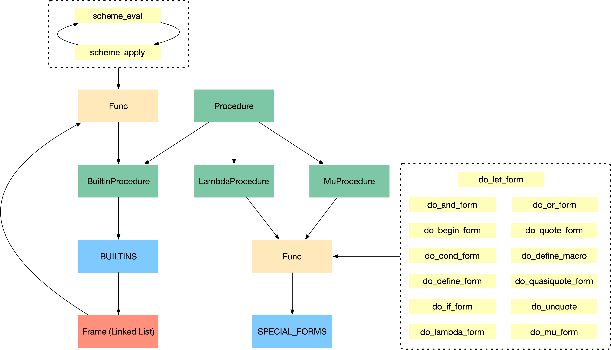

# UCB CS61A 2022 Summer: Structure && Interpretation of Computer Program

> Computer Science is about '3A': Abstraction, Algorithm, Automation. And here comes Abstraction. \
> And CS61A teaches me thinking programming in computational perspective, instead of API perspective \
> CMU CSAPP teaches me thinking programming in OS perspective

Projects, Labs, HWs, Discs and Notes about CS61A.
This is an awesome class that everyone should take.

## Topics

- Structure
  - Program = Function + Data
  - 3 part of a program language: expr / statements, means of combination, means of abstraction.
  - concepts:
    - Iteration: not loop
      - lazy computation
      - iterator and generator
    - Recursion: not Fibonacci this time
      - for languages like scheme which don't have loop statements
      - REPL in Interpreter: mutual recursive
      - Linked List: a recursive object
    - **Environment**: correct way to think of program in user-level, CMU CSAPP will dig this one level deeper: machine level
    - Data Structure: Linked List (implemented by Function or Class, two paradigms)
    - Mutability: list vs tuple, Python vs Scheme
    - Abstraction: constructor / selector, higher order function
    - Efficiency: Tail Recursion
- Interpreter:
  - Program is nothing but expression tree. illustrated by Scheme.
  - Expr Tree -> Lexical Analysis (Parser, syntax phase) -> Eval (semantic phase) <-> Apply: Duel Recursive functions
  - REPL: read-eval-print-loop

Topics that refreshes me are:

- Environment Diagram by PythonTutor: that's how you should think of programming
- Recursive: This time not Fibbnacci sequence, quite boring. Understanding of Recursion can be 3 level:
    1. Manipulate Linked List, Tree, and Graph
    2. Substitute Repeat control in a language with no such things, like `Scheme`, `Lisp`.
    3. Frame (or stack in OS) is the deepest reason, and that's why `Tail Calls` are important in `Scheme`
- Higher Order Functions: abstraction of procedure.
- Functional Programming: i first get my hands on this kind of paradigm is Jax by Google, kind of strange.

## TODO

- SQL and RegEx stuffs: Disc 11, Lab 11, HW7
- Final Review: Lab 12, HW8, Disc 12
- Optional Bonus in all hws, labs, discs and projects
